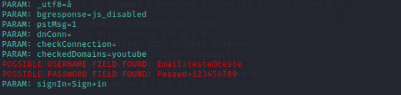

# DIO Cyber Security Desafio Phishing
Desafio da Formação Cybersecurity Specialist - DIO

### Ferramentas
* Kali Linux
* setoolkit

### Configurando o Phishing no Kali Linux
* Acesso root: sudo su
* Iniciar o setoolkit
* Tipo de ataque: Social-Engineering Attacks
* Vetor de ataque: Web Site Attack Vectors
* Método de ataque: Credential Harvester Attack Method
* Método de ataque: Web Templates
* Tipo de template: Google
* Obtendo o endereço da máquina: ifconfig

### Resultados

